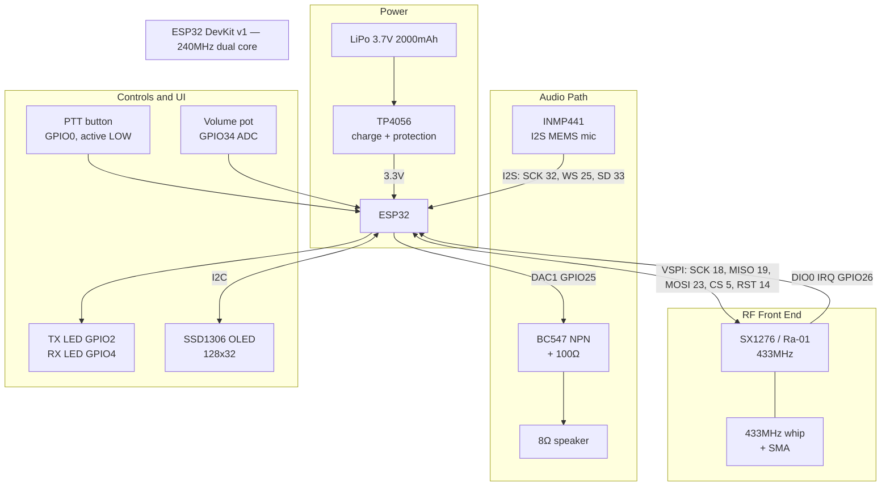
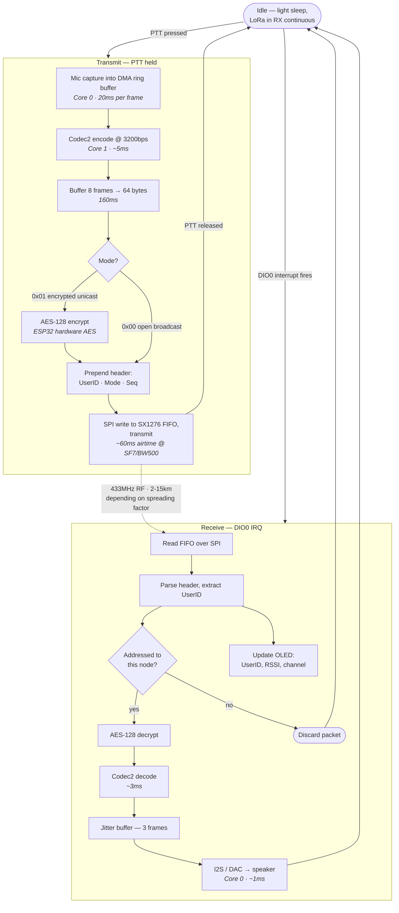

# Ranger: LoRa-Based Encrypted Mesh Communication System

A low-power, handheld communication device built on LoRa (SX1276/SX1281) and ESP32. Operates independently of cellular towers, SIM cards, subscriptions, and government-controlled infrastructure. Designed for emergency and disaster response, field operations, remote area coordination, and encrypted private messaging.


---

## The Problem

Five core problems this project addresses:

1. **Single Point of Failure** - Cellular networks depend on towers and power grids. During disasters (earthquakes, floods, blackouts), they collapse at the worst possible moment.
2. **Government Control** - Authorities can shut down or throttle cellular networks at will.
3. **Subscription Costs & Dependencies** - Every SMS, call, or data packet requires an active SIM contract and ongoing payments.
4. **Zero Encryption** - Analog walkie-talkies broadcast in open. Anyone on the same frequency intercepts every transmission.
5. **No Location Awareness** - Standard radios carry voice only. Rescue coordinators cannot see where teams or survivors actually are.

---

## The Vision

A Ranger node installed in each home forms an instant community mesh network that activates the moment cellular service fails. No towers. No subscriptions. No single point to bring it down.

---

## Key Features

| Feature | Description |
|---------|-------------|
| **Voice over LoRa** | Codec2-compressed voice in LoRa packets. Several km of range. |
| **Selectable Encryption** | Open broadcast mode for team communications. AES-128 end-to-end encrypted mode for private one-to-one calls. User selects per transmission. |
| **User Identification** | Every device carries a unique UserID in the custom packet header. |
| **Text Messaging** | Ad-hoc short text messages transmitted over the same LoRa link. No infrastructure required. |
| **Range Expansion** | Optional LoRaWAN gateway relay extends reach without modifying handsets. |
| **GPS Location Sharing** | GPS + compass transmits coordinates. Receiving unit displays direction and approximate distance to sender. |
| **Low Power Operation** | Sleep modes for extended battery life in standby. |
| **Half-Duplex PTT** | Push-to-talk interface for intuitive walkie-talkie operation. |

---

## Architecture

### MVP Hardware Structure (Phase 1)

The breadboard MVP centres on a single ESP32 DevKit v1. Every peripheral hangs off one of four buses — SPI for the radio, I2S for the microphone, the internal DAC for audio out, and I2C for the display — with GPIO handling the push-to-talk button, LEDs, and volume pot. Power comes from a LiPo cell through a TP4056 charger.



> **Note on the MVP audio output:** GPIO25 serves double duty as both the I2S word-select line for the microphone and DAC1 for speaker output. This is workable only because the device is half-duplex — it never captures and plays back at the same time. Phase 2 removes the conflict by moving speaker output to a MAX98357A I2S amplifier on GPIO22.

### How the Device Works

A transmission begins when the user holds PTT. Audio is captured, compressed roughly 40:1 by Codec2, optionally encrypted, wrapped in a 68-byte packet, and pushed out over LoRa. The receiving unit reverses the process. Work is split across both ESP32 cores: Core 0 handles the time-critical I2S DMA transfers, Core 1 does the CPU-heavy compression and radio control.



End-to-end latency lands around **250ms**, dominated by the 160ms spent buffering eight Codec2 frames into a single LoRa payload. That is comfortably inside the range users tolerate for push-to-talk: cellular phones target 150ms, and analog radio typically runs 300-500ms.

---

## Hardware Stack

### Primary Components (Phase 1 - Breadboard MVP)

| Component | Part | Purpose |
|-----------|------|---------|
| Microcontroller | ESP32 DevKit v1 | Dual-core 240MHz, I2S, SPI, hardware AES |
| LoRa Module | SX1276 (Ra-01, 433MHz) | RF transceiver |
| Microphone | INMP441 I2S breakout | Digital MEMS mic, clean audio input |
| Speaker Driver | BC547 NPN transistor + 100Ω resistor | Drives speaker from ESP32 DAC |
| Speaker | 8Ω speaker | Audio output |
| Battery | 3.7V 2000mAh LiPo | Power supply |
| Charger | TP4056 module | LiPo charging + protection |
| Antenna | 433MHz whip + SMA | RF coverage |
| Display | SSD1306 OLED (128x32, I2C) | Channel, RSSI, UserID, battery status |

### Phase 2 - Custom PCB Enhancements

| Component | Part | Purpose |
|-----------|------|---------|
| Transceiver | EBYTE E28-2G4M27SX (SX1281, 2.4GHz) | 203kbps LoRa / 2Mbps FLRC modes |
| Audio Amplifier | MAX98357A I2S Class-D | Loud, clear voice output |
| GPS Module | ATGM336H or Quectel L76-LB | Location tracking and compass data |
| Power Converter | AP63203 or AP3429A (Sync Buck) | 1.5-2A @ 3.3V, handles 580mA TX spikes |
| USB-UART Bridge | CH340K or CP2102N | Programming and debugging |
| Keypad | 4x3 or 4x4 matrix with 1N4148 diodes | T9-style text input |

---

## RF Technology Overview

### LoRa (SX1276) - Primary Selection

**Advantages:**
- 433MHz band penetrates terrain better than 2.4GHz
- Ultra-low power consumption
- Proven range: 2-15km LOS depending on spreading factor
- LoRaWAN infrastructure exists in many cities

**Bitrate Trade-off (SX1276):**
- Codec2 voice requires 700bps-3200bps (intelligible at 3200bps)
- LoRa max practical throughput at SF7/BW500: ~5.47 kbps

| Spreading Factor | Air Rate | Practical Range |
|------------------|----------|-----------------|
| SF12 | 293 bps | ~15 km |
| SF9 | 1.76 kbps | ~8 km |
| SF7 | 5.47 kbps | ~2-3 km |

### SX1281 (E28 Module) - High-Bandwidth Fallback

Use if SF7 bandwidth proves insufficient:

| Mode | Max Bitrate | Practical Range |
|------|-------------|-----------------|
| LoRa | 203 kbps | 1-3 km |
| FLRC | 2 Mbps | 500m-1km |
| GFSK | 2 Mbps | 500m-1km |

---

## Software Architecture

### ESP32 FreeRTOS Task Distribution

```
Core 0: I2S drivers (mic RX + speaker TX DMA) [TIME CRITICAL]
Core 1: Codec2 encode/decode, UI, LoRa SPI control [CPU HEAVY]
```

### Transmission Flow

```
INMP441 I2S -> DMA ring buffer -> Codec2 encoder -> 8 frames buffered
-> 64-byte LoRa payload -> SX1276 SPI TX
```

### Reception Flow

```
SX1276 DIO0 IRQ -> FIFO read -> audio queue
-> Codec2 decoder -> jitter buffer (3 frames) -> I2S DAC -> speaker
```

### Packet Structure

```
[ UserID : 2 bytes ][ Mode : 1 byte ][ Seq : 1 byte ][ Codec2 payload : 64 bytes ]
```

**Mode Byte:**
- `0x00` = Broadcast (open, no encryption)
- `0x01` = Encrypted unicast (AES-128)

### Latency Budget

| Stage | Time |
|-------|------|
| Mic capture (1 Codec2 frame) | 20ms |
| Codec2 encode | ~5ms |
| Buffer 8 frames | 160ms |
| LoRa TX airtime (SF7, BW500, 64B) | ~60ms |
| Codec2 decode | ~3ms |
| DAC + speaker | ~1ms |
| **Total** | **~250ms** |

Acceptable for push-to-talk operation (phones target 150ms, analog radio 300-500ms).

---

## ESP32 Pin Assignments

### SX1276 (VSPI)

| Signal | GPIO |
|--------|------|
| SCK | GPIO18 |
| MISO | GPIO19 |
| MOSI | GPIO23 |
| NSS/CS | GPIO5 |
| RST | GPIO14 |
| DIO0 (IRQ) | GPIO26 |

### INMP441 I2S Microphone

| Signal | GPIO |
|--------|------|
| SCK | GPIO32 |
| WS | GPIO25 |
| SD | GPIO33 |
| L/R | GND (left channel) |

### Speaker (BC547 Driver / MAX98357A)

| Signal | GPIO |
|--------|------|
| DAC out (MVP) | GPIO25 (DAC1) |
| I2S DOUT (Phase 2) | GPIO22 |

### Controls & UI

| Component | GPIO |
|-----------|------|
| PTT Button (active LOW, 10k pullup) | GPIO0 |
| TX LED (red, 330Ω) | GPIO2 |
| RX LED (green, 330Ω) | GPIO4 |
| Volume Pot (ADC) | GPIO34 |

---

## Build Phases

### Phase 1: Breadboard MVP (Months 1-3)

- [x] ESP32 + SX1276 LoRa module on breadboard
- [x] INMP441 I2S microphone integration
- [x] Codec2 ESP32 port (`rebezhir/codec2-esp32`)
- [ ] Local encode/decode quality validation
- [x] LoRa text packet exchange (two units)
- [x] Codec2 audio piped into LoRa packets
- [ ] PTT state machine implementation
- [ ] Custom packet header with UserID
- [ ] Broadcast vs. encrypted unicast modes
- [x] BC547 speaker output

### Phase 2: Custom PCB + Expansion (Months 4-6)

- [ ] Custom PCB design (4-layer stack-up)
- [ ] AES-128 encryption via ESP32 hardware AES
- [ ] SSD1306 OLED display integration
- [ ] GPS module integration (ATGM336H or Quectel L76-LB)
- [ ] Compass IC integration (directional display)
- [ ] Location packet implementation
- [ ] Direction + distance calculation on receiver
- [ ] LoRaWAN gateway relay support
- [ ] Ad-hoc text messaging (T9 keypad)
- [ ] Field range testing and latency measurement
- [ ] Enclosure design

---

## PCB Design Critical Requirements (Phase 2)

### Power Supply Stability

The E28 module draws **580mA** during 27dBm transmission. This is the single largest design constraint.

**Must-Have:**
- 1000µF low-ESR capacitor (Tantalum or Aluminum) physically closest to E28 VCC pin
- AP63203 or AP3429A synchronous buck converter (not LDO)
- Buck inductor with saturation current > 2A

Without proper bulk capacitance, the ESP32 browns out and resets every time PTT is pressed.

### 4-Layer PCB Stack-up

Do NOT attempt a 2-layer board. Required stack:

1. **Top Layer** - Signal traces, RF trace, components
2. **Inner Layer 1** - Solid, unbroken Ground Plane (critical for 50Ω impedance and audio isolation)
3. **Inner Layer 2** - 3.3V power routing
4. **Bottom Layer** - Signal traces, keypad matrix

### Audio and RF Isolation

- Keep I2S digital audio lines far from RF antenna trace and buck converter inductor
- Place via stitching around E28 module footprint
- Separate ground planes for audio and RF sections only if necessary (generally single solid GND is best)

### Keypad Anti-Ghosting

- Place **1N4148 switching diode** in series with every tactile button
- Prevents ghosting when user presses multiple keys simultaneously
- **Alternative:** Use TCA9555 I2C I/O Expander for entire matrix (saves GPIO pins)

### Premium GPS Modularity

Design GPS section on isolated PCB peninsula:
- Place **solder bridge** on 3.3V line to GPS module
- Base models: Leave GPS components unpopulated (DNP)
- Premium models: Solder on GPS + bridge power
- ESP32 auto-detects UART NMEA data on boot and enables GPS UI

---

## Demonstration Plan

1. Live two-way voice call between two units across open ground
2. Switch between broadcast and encrypted one-to-one modes on demand
3. Display UserID on receiving handset
4. Display GPS position, direction, and distance between units

---

## Dependencies & Libraries

| Library | Purpose | Link |
|---------|---------|------|
| Codec2 ESP32 Port | Voice compression | https://github.com/rebezhir/codec2-esp32 |
| Arduino LoRa | LoRa transceiver control | https://github.com/sandeepmistry/arduino-LoRa |
| Meshtastic | Reference mesh implementation | https://meshtastic.org |
| FreeRTOS | Task scheduling (built into ESP32 IDF) | https://www.freertos.org |

### Datasheets

- SX1276 Datasheet (Semtech)
- SX1281 Datasheet (Semtech)
- ESP32 Technical Reference Manual (Espressif)
- EBYTE E28-2G4M27SX Product Page (EBYTE official)

---

## Alternative RF Modules Considered

| Module | Chip | Bitrate | Range | Notes |
|--------|------|---------|-------|-------|
| Ra-01 | SX1276 | 5 kbps (LoRa) | 2-15 km | Primary choice |
| E28-2G4M27SX | SX1281 | 203 kbps / 2 Mbps | 1-3 km | High-bandwidth fallback |
| RFM69HCW | SX1231 | 300 kbps | 500m-1km | FSK mode |
| nRF24L01+PA+LNA | nRF24L01 | 2 Mbps | 500m-1km | 2.4GHz ISM band |

---

## Development Log

Ongoing testing and prototype notes (OLED screens, LoRa examples, audio/mic tests, etc.) are tracked in [docs/development_log.md](docs/development_log.md).

---

## Getting Started

### Prerequisites

- ESP32 DevKit v1 or compatible board
- Arduino IDE or PlatformIO
- Git
- USB-C cable for flashing and debugging

### Quick Start (Phase 1)

```bash
# Clone this repository
git clone https://github.com/NadeeshaNJ/Ranger.git
cd Ranger

# Install Codec2 ESP32 dependency
git clone https://github.com/rebezhir/codec2-esp32.git lib/codec2-esp32

# Open in Arduino IDE or PlatformIO
# Configure board: ESP32 DevKit v1
# Select COM port and flash
```

### Testing Checklist

- [ ] Serial monitor shows boot messages
- [ ] LoRa module responds to SPI reads
- [ ] Microphone captures audio
- [ ] Speaker produces output
- [ ] PTT button triggers TX LED
- [ ] Codec2 encode/decode produces intelligible audio
- [ ] Two units exchange text packets
- [ ] Two units exchange voice packets

---

## Project Structure

```
Ranger/
├── src/
│   ├── main.cpp                 # Core application entry
│   ├── lora.cpp / lora.h         # SX1276 driver
│   ├── audio.cpp / audio.h       # I2S mic/speaker management
│   ├── codec2_wrapper.cpp / .h   # Codec2 integration
│   ├── encryption.cpp / .h       # AES-128 implementation
│   ├── gps.cpp / gps.h           # GPS + compass (Phase 2)
│   ├── ui.cpp / ui.h             # Display + keypad
│   └── config.h                 # Pin definitions, constants
├── lib/
│   ├── codec2-esp32/            # Codec2 compression library
│   └── arduino-lora/            # LoRa transceiver library
├── hardware/
│   ├── breadboard_schematic.pdf # Phase 1 reference
│   └── pcb_design/              # Phase 2 KiCAD files (coming soon)
├── docs/
│   ├── project_knowledge_base.md
│   ├── Device_Structure_and_PCB_Plan.md
│   └── RF_analysis.md           # Spreading factor trade-offs
├── test/
│   ├── test_codec2.cpp
│   ├── test_lora.cpp
│   └── test_audio_loopback.cpp
├── README.md                    # This file
├── LICENSE                      # Open source license (TBD)
└── platformio.ini              # Build configuration
```

---

## Contributing

This is an active research and development project. Contributions are welcome in the following areas:

- Codec2 optimization for ESP32
- PCB layout review for RF/power integrity
- GPS compass integration firmware
- Field testing data and range reports
- Enclosure CAD models
- LoRaWAN gateway integration

---

## License

[TBD - To be selected by maintainer]

---

## Contact & Support

**Author:** Nadeesha  
**Repository:** https://github.com/NadeeshaNJ/Ranger  
**Issues:** GitHub Issues tracker

---

## Acknowledgments

- Codec2 community (David Rowe)
- Semtech (LoRa and SX1276 development)
- Arduino community
- Meshtastic project for mesh networking inspiration

---

## Project Timeline

- **Intake:** 2023
- **Duration:** 6 months
- **Lab:** Embedded Systems Lab
- **Current Phase:** Phase 1 (Breadboard MVP)

---

**Last Updated:** July 2026

*A communication system built for the world when it all goes dark.*
