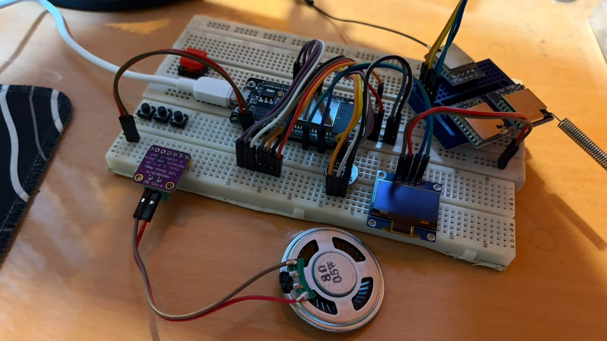
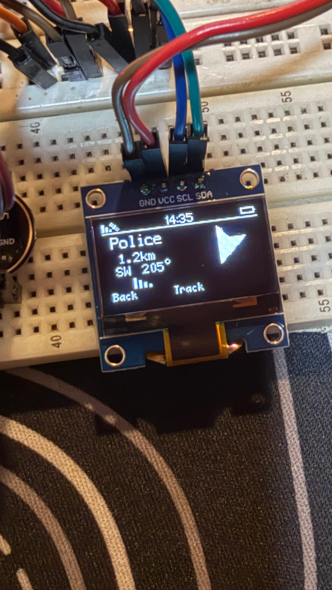

# Development Log

A running record of hands-on testing and prototypes built while bringing up the Phase 1 breadboard MVP. Each entry maps to a commit; see `git log` for full diffs.

---

## 2026-07-17 — First OLED display bring-up (`357f88f`)

Got the SSD1306 OLED talking over I2C using the U8g2 library.

- `Ranger/lib/OLEDscreen/U8g2/logo.cpp` — boot logo bitmap render.
- `Ranger/lib/OLEDscreen/U8g2/statusbar.cpp` — first pass at the status bar (battery, RSSI, UserID).
- `Ranger/lib/OLEDscreen/test/GUI.cpp`, `Ranger/lib/OLEDscreen/test/main.cpp` — standalone U8g2 test harness, separate from the U8x8-based `OLEDscreen` lib stub.

## 2026-07-18 — Menu and People screens (`5561d73`)

- `Ranger/lib/OLEDscreen/U8g2/menu.cpp` — main menu UI.
- `Ranger/lib/OLEDscreen/U8g2/people.cpp` — contact/people list screen.
- Extended `statusbar.cpp` for the new screens.

## 2026-07-18 — Messages, Footbar, Location, Track, People2 screens (`f16438c`)

- `Ranger/lib/OLEDscreen/U8g2/Messages.cpp` — message list screen.
- `Ranger/lib/OLEDscreen/U8g2/footbar.cpp` — bottom nav bar.
- `Ranger/lib/OLEDscreen/U8g2/Location.cpp` — GPS/location display screen.
- `Ranger/lib/OLEDscreen/U8g2/Track.cpp` — device tracking screen.
- `Ranger/lib/OLEDscreen/U8g2/people2.cpp` — revised people list layout.

## 2026-07-19 — Chat message handling (`cd2ffab`)

- `Ranger/lib/OLEDscreen/U8g2/message2.cpp` — message thread rendering.
- `Ranger/lib/OLEDscreen/U8g2/messageType.cpp` — message type/status indicators (sent, received, encrypted).

## 2026-07-19 — Audio and LoRa examples (`df4bfa7`)

Reorganized audio tests and added standalone LoRa communication examples.

- `Ranger/lib/LoRa/test/sender.cpp`, `Ranger/lib/LoRa/test/receiver.cpp` — basic LoRa send/receive examples (moved under `test/`).
- `Ranger/lib/Sound/test/single_tone.cpp` — single-tone I2S generation test (moved from `MAX98357A_Amp`).
- `Ranger/test/sound/mic.cpp` — real-time audio level monitoring on the INMP441 mic.
- `Ranger/test/sound/mic_and_speaker.cpp` — record from INMP441, playback on MAX98357A.
- `Ranger/test/sound/Sender_mic_and_lora.cpp`, `Ranger/test/sound/Receiver_mic_and_lora.cpp` — voice capture/playback piped over LoRa, combining the mic/speaker and radio paths for the first time.

## 2026-07-19 — Codec2 + LoRa voice pipeline debugging (`Ranger/test/codec2/`)

Bringing up live mic capture → Codec2 encode → LoRa transmit (`sender_sound.cpp` / `receiver_sound.cpp`) surfaced four crashes in sequence, each masking the next until fixed.

**Problem 1: Board reset immediately on the first loop pass, no error message — clean watchdog reset.**

Root cause: `i2s_read()` running at 8000Hz with `use_apll = false` and stereo channel format. The ESP32's standard PLL clock divider cannot cleanly generate an 8kHz I2S clock, and 32-bit stereo capture at that rate compounded the problem. The DMA transfer never completed, so the blocking `i2s_read()` call waited forever, starving the idle task until the Task Watchdog force-reset the board.

Fix: enabled `use_apll = true` and switched from stereo (`I2S_CHANNEL_FMT_RIGHT_LEFT`) to mono (`I2S_CHANNEL_FMT_ONLY_LEFT`) capture, which also correctly reflects the hardware, since the INMP441's L/R pin is tied to GND and only ever outputs one channel.

**Problem 2: After the I2S fix, still crashing, now silently mid-loop with no error printed.**

Diagnosis method: added explicit debug print statements at every stage of `setup()` and `loop()` to bracket exactly where execution stopped.

Root cause found: execution consistently stopped right after entering `codec2_encode()`, and never returned. Codec2's internal DSP routines (LPC analysis, pitch estimation) need more stack space than the 8KB Arduino allocates by default to its main loop task.

Fix: moved the read/encode/send logic into a dedicated FreeRTOS task created with `xTaskCreate`, initially with a 20000 byte stack.

**Problem 3: New crash type, a "Guru Meditation Error" with a stack canary watchpoint trigger naming `codec2_task` directly.**

Root cause: the 20000 byte stack still wasn't sufficient for Codec2's actual peak stack usage during encoding.

Fix: increased the dedicated task's stack allocation to 32768 bytes, matching a value already proven sufficient in a reference Codec2/LoRa implementation using the same library.

**Problem 4: Board ran successfully for a fixed ~5.7 seconds, then reset with a Task Watchdog Timer abort, repeating on a consistent cycle.**

Root cause: the dedicated encode task ran in a tight loop at a priority high enough that it never yielded the CPU. This prevented the low-priority IDLE0 task on Core 0 from ever running, and since IDLE0 is responsible for periodically resetting the hardware watchdog, its starvation triggered a forced abort every 5 seconds (the watchdog's check interval).

Fix: added a `vTaskDelay(pdMS_TO_TICKS(1))` at the end of each loop iteration inside the task, an explicit yield that guarantees the scheduler gives other tasks, including IDLE0, a chance to run each cycle.

**Outcome:** stable, continuous Codec2 encoding and LoRa transmission from live microphone input, confirmed by uninterrupted "Sent encoded frame" output with no resets.

---

*Add new entries above this line as testing continues.*
