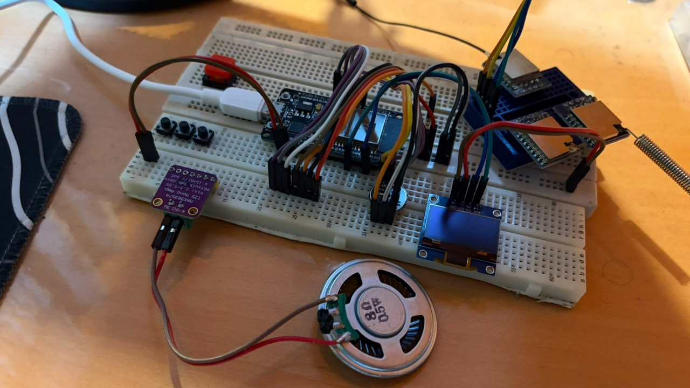
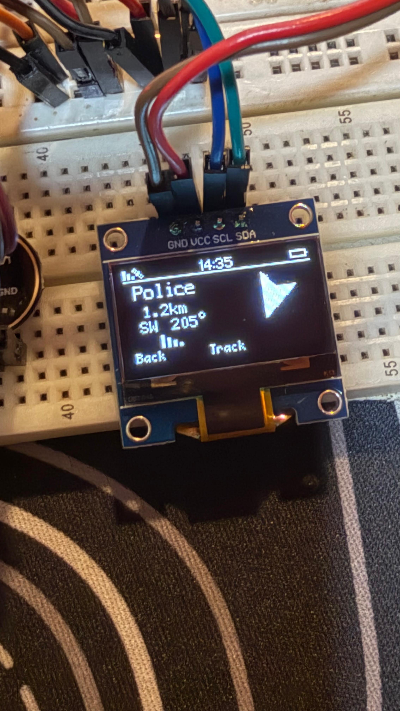

# Development Log

A running record of hands-on testing and prototypes built while bringing up the Phase 1 breadboard MVP. Each entry maps to a commit; see `git log` for full diffs.

Entries are condensed to the decisions and root causes worth remembering. Anything recoverable from the diff itself is left to `git log`.

---

## 2026-07-17 → 07-19 — OLED screen suite (`357f88f`, `5561d73`, `f16438c`, `cd2ffab`)

Brought up the SSD1306 over I2C with U8g2 and built out the screen set under `Ranger/lib/OLEDscreen/U8g2/`: boot logo, status bar (battery, RSSI, UserID), main menu, people list (two layouts), messages, message threads with type indicators, footbar nav, location, and tracking.

Each screen was written as a standalone sketch with its own `u8g2` global and `loop()` — fine for testing one at a time, but they cannot coexist in one firmware. Resolved much later; see 2026-08-12.

## 2026-07-19 — Audio and LoRa examples (`df4bfa7`)

Reorganized audio tests and added standalone LoRa send/receive examples. Notable additions: `mic.cpp` (live level monitoring on the INMP441), `mic_and_speaker.cpp` (record then play back), and `Sender_/Receiver_mic_and_lora.cpp` — the first time the mic/speaker and radio paths ran together.

## 2026-07-19 — Codec2 + LoRa voice pipeline debugging (`Ranger/test/codec2/`)

Bringing up mic → Codec2 → LoRa surfaced four crashes in sequence, each masking the next.

1. **Instant watchdog reset.** `i2s_read()` at 8 kHz with `use_apll = false` and stereo format — the standard PLL divider cannot cleanly generate an 8 kHz I2S clock, so the DMA transfer never completed and the blocking read starved the idle task. Fixed with `use_apll = true` and mono capture (which also matches the hardware: the INMP441's L/R pin is tied to GND).
2. **Silent mid-loop crash.** Bracketing `setup()`/`loop()` with prints showed execution stopping inside `codec2_encode()`. Codec2's DSP routines need more stack than the 8 KB Arduino gives its main loop task. Moved to a dedicated FreeRTOS task.
3. **Stack canary trip naming `codec2_task`.** 20 KB still wasn't enough; raised to 32768 bytes.
4. **Watchdog abort on a ~5.7 s cycle.** The encode task never yielded, so IDLE0 never ran to pet the watchdog. Fixed with `vTaskDelay(1)` per iteration.

**Outcome:** stable continuous encode and transmit from live mic input.

## 2026-07-29 — PCF8575 button expander

Brought up a PCF8575 I2C expander (addr `0x20`) for the button stack. Straight polling doesn't hold up once `loop()` is doing real work, so switched to the expander's INT pin driving an ESP32 external interrupt — the ISR only flags, and the I2C read plus debounce happen outside interrupt context.

Also split the tone test into `single_tone_MAX98357A.cpp` and `single_tone_PCM5100A.cpp` so each DAC's wiring notes survive independently.

> Note: this sketch wired INT to GPIO4, which later collided with LoRa DIO0. See 2026-08-12.

## 2026-08-06 → 08-07 — Phase 2 PCB, docs, and BOM (`ec6d6ba`, `3659219`, `05dcd8b`, `87578fa`, `1c1ad94`)

Phase 2 custom PCB committed: schematic with E28-2G4M27SX (SX1281 2.4 GHz), MAX98357A, AP63203 buck, GPS connector, 4x3 keypad matrix. 4-layer layout with ground plane isolation, 50Ω RF trace, bulk capacitance for 580 mA TX spikes, via stitching around the RF section. GPS section is optional (solder bridge + DNP). Keypad anti-ghosting via 1N4148 diodes.

Accompanied by `docs/Ranger_Phase2_PCB_README.md` (pin connections, power, bus assignments) and the component BOM including the charger module.

## 2026-08-09 — Walkie-talkie over LoRa (`e34d7f5`, `55d17b5`, `e9ae261`)

First working half-duplex PTT voice link: Codec2 encode → LoRa → decode → speaker.

Build setup reworked at the same time. `src_dir` is a global PlatformIO option and cannot be set per-environment, so `scripts/set_src_dir.py` reads a `custom_src_dir` option and overrides the source directory per build. Two environments (`node_a`, `node_b`) target the two boards by USB serial number rather than `/dev/ttyUSB*`, since the kernel hands those out in plug order and they flip between runs.

## 2026-08-10 — Decoupled capture, working but harsh audio (`ffd9904`)

Audio worked end to end but sounded bad. Two causes found and fixed:

**Capture stalled during transmit.** The mic clocks continuously whether or not anyone reads it, so every blocking `LoRa.endPacket()` was a stretch where the I2S DMA ring filled with nobody draining it — a gap in the speech every packet. Split capture into its own task pinned to core 0, joined to `loop()` by a queue of encoded frames. On overflow the *oldest* frame is dropped: blocking the producer would just move the overflow back into the DMA ring where it is invisible, whereas dropping bounds latency and keeps the newest speech. Drops and short reads are counted and printed on PTT release.

**Codec2 stack sizes were guessed, not measured.** Two crashes came from this. Frame sizes read from the built firmware's `entry` instructions gave the real numbers: encode needs `analyse_one_frame` (12352 B) → `nlp` (8256 B) ≈ 20.6 kB; decode needs `codec2_decode_1300` (7232 B) → `aks_to_M2` (8272 B) → `lpc_post_filter` (10288 B) ≈ 25.8 kB. Set to 32 kB for the mic task and 40 kB for `loop()` via `ARDUINO_LOOP_STACK_SIZE`. A stack high-water print on PTT release now makes headroom visible instead of guessed.

**Also fixed:** encode and decode were sharing one `CODEC2` handle across two cores. That handle carries mutable per-frame state both directions write through; sharing it crashed with `LoadProhibited` on the first PTT press after a receive. Now one handle per direction.

## 2026-08-11 — Hardware split into libraries (`fed167c`)

Every piece of hardware handling moved behind a library so `main.cpp` is only the state machine:

| Library | Responsibility |
|---|---|
| `lib/Mic` | I2S capture, 32→16 bit conversion, stereo→mono |
| `lib/Sound` | I2S playback, start/stop, tone generator |
| `lib/Radio` | LoRa modem setup and packet I/O |
| `lib/Codec` | Codec2 handle (one per direction) + `FrameQueue` |
| `lib/Buttons` | Debounced PTT |

Each carries a `library.json` pinning `srcDir: "src"`, so the `test/` folder alongside it is not compiled into the firmware — without that, every test sketch's `setup()`/`loop()` collides.

Speaker DMA also resized from `8 × 64` (512 samples) to `6 × 320`. A single write is 640 samples, so the old ring was smaller than one write and blocked partway through every frame. Set `tx_desc_auto_clear = true` so an underrun emits silence rather than replaying the last buffer.

## 2026-08-12 — OLED, keypad, and UI integration (pending commit)

**Three new libraries.** `lib/Screen` wraps the U8g2 drawing code from `test/OLEDscreen/U8g2/` — geometry and lopaka bitmaps kept verbatim, but sharing one panel instead of each file declaring its own global. `lib/Keypad` drives five navigation buttons (up/down/left/right/enter on PCF8575 P0–P4), keeping the tested INT-plus-periodic-resample pattern and delivering presses through a queue so a short press is never lost while `loop()` is busy. `lib/UI` is the glue: it owns the menu structure, selection state, and redraw policy, and is the only file to edit when changing what the device shows.

**Pin conflict resolved.** The tested button sketch put the PCF8575 INT on GPIO4, which is LoRa DIO0 on this board. INT moved to **GPIO13** — this requires physically moving the wire.

**PTT wins over the UI.** A full 128×64 I2C flush costs several milliseconds against a 40 ms audio frame deadline, so `render()` only redraws when a dirty flag is set, and `update()`/`render()` are called only on the idle path. Keypresses during audio are discarded rather than queued, so releasing PTT does not replay a burst of menu moves. TX and RX each trigger exactly one redraw, on the transition.

`Screen.begin()` and `Keypad.begin()` warn rather than halt — a missing display should not take the radio down.

**Still open:** audio is quiet and unidirectional. The DAC does not reproduce distinct frequencies: a standalone tone sweep (`test/sound/speaker_tester_range_of_freq.cpp`) sounds identical at 400 Hz and 1 kHz, which rules out the mic, Codec2, and the radio. Prime suspect is the DIN pin — the known-good `test/sound/single_tone_PCM5100A.cpp` drives DIN on **GPIO25 / I2S_NUM_0** at 44.1 kHz, while `main.cpp` uses **GPIO15 / I2S_NUM_1** at 8 kHz. Whether the DAC locks to 8 kHz without an MCLK is the second thing to check.

`test/walkie_talkii/` keeps V1 (noisy, but the version whose behaviour was actually observed on hardware), V2 (same behaviour rewritten against the libraries), and V3 as reference points.

---

*Add new entries above this line as testing continues.*
